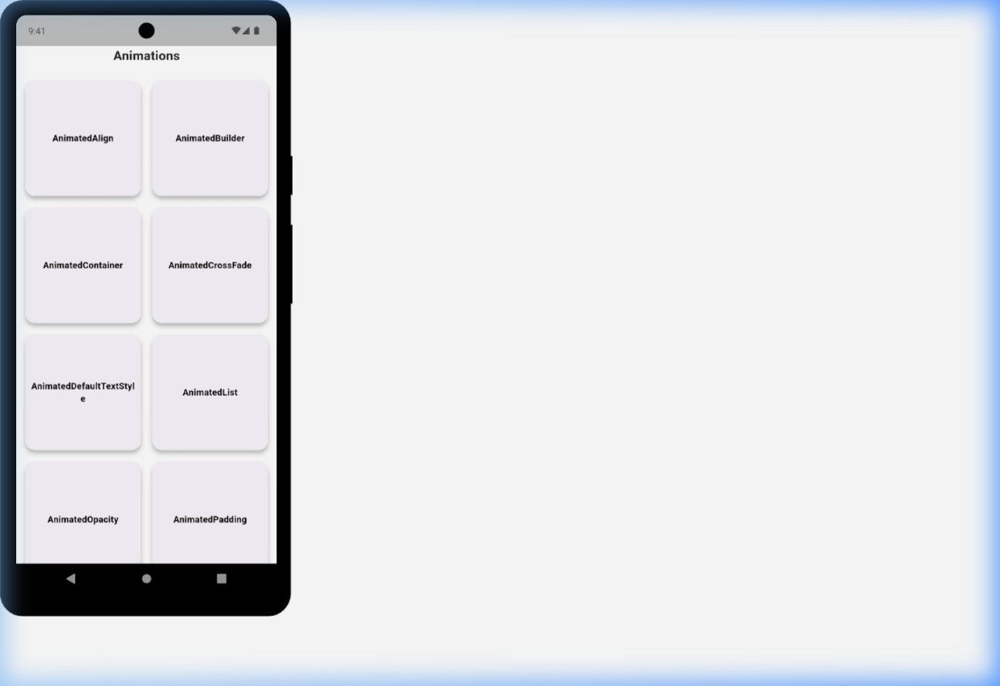
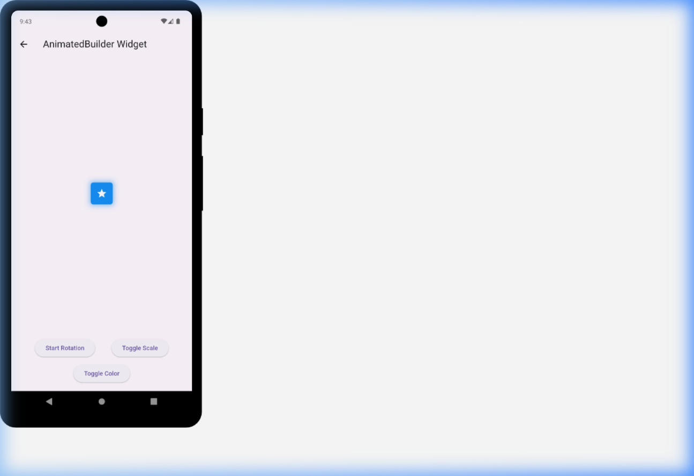
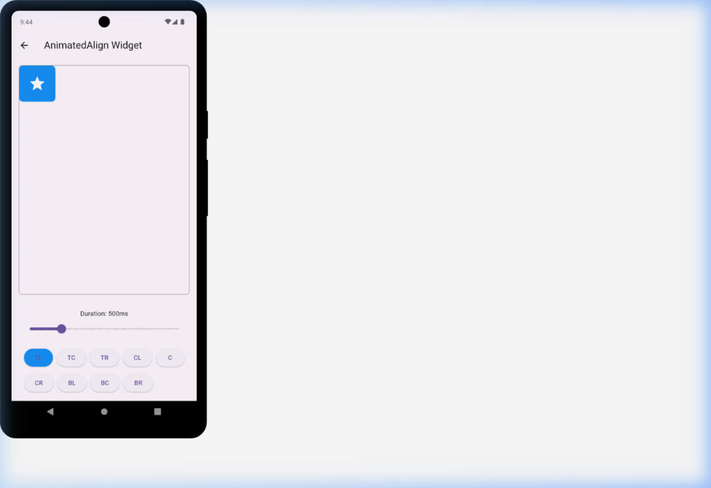

# ✨ Flutter Animations Gallery

A premium, comprehensive showcase of Flutter's animation capabilities. This project serves as a visual guide and reference for developers to understand and implement both **Implicit** and **Explicit** animations, as well as complex custom transitions and navigations.

---

## 🌟 Features

### 🎬 Implicit Animations
Beautifully crafted examples of Flutter's self-managing animation widgets:
- **AnimatedContainer**: Smoothly transition sizes, colors, and borders.
- **AnimatedOpacity**: Fade elements in and out with ease.
- **AnimatedPadding**: Dynamic spacing transitions.
- **AnimatedAlign & Positioned**: Fluid movement across the screen.
- **AnimatedDefaultTextStyle**: Elegant font and style transitions.
- **AnimatedPhysicalModel**: Realistic elevation and shadow changes.

### 🎭 Explicit & Transition Animations
Fine-grained control over complex animations using `AnimationController`:
- **Fade, Scale, & Rotation Transitions**: Essential building blocks for UI motion.
- **Size & Slide Transitions**: Dynamic layout entries and exits.
- **TweenAnimationBuilder**: Custom interpolation for unique effects.
- **AnimatedBuilder**: Highly optimized, custom-rendered animations.

### 🍱 Advanced UI Components
State-of-the-art navigation and drawer implementations:
- **Zoom Drawer**: Modern, multi-layered navigation.
- **Hidden Drawer**: Clean, off-canvas menu system.
- **Collapsible Drawer**: Space-efficient sidebar navigation.
- **Beautiful Animated Transitions**: Custom Matrix4 transformations for a premium feel.

---

## 📸 visual Overview

| Landing Screen | Animated Builder |
| :---: | :---: |
|  |  |

| Animated Align | Animated Container |
| :---: | :---: |
|  |  |

| List View | Scrolled List |
| :---: | :---: |
|  |  |

---

## 🛠️ Tech Stack

- **Framework**: [Flutter](https://flutter.dev/) (3.x)
- **Navigation**: Custom Material Routing & Advanced Matrix4 Transformations.
- **Key Packages**: 
  - `hidden_drawer_menu`: For immersive menu experiences.
  - `flutter_zoom_drawer`: For modern navigation patterns.
- **Styling**: Custom Theme System, Google Fonts integration ready.

---

## ⚙️ Installation & Setup

### Prerequisites
- Flutter SDK installed (`flutter doctor` should be green)

### Steps
1. **Clone the repository**:
   ```bash
   git clone <(https://github.com/muazamadeel/animations)>
   cd animations
   ```

2. **Install dependencies**:
   ```bash
   flutter pub get
   ```

3. **Run the App**:
   ```bash
   flutter run
   ```

---

## 📁 Project Structure

```text
lib/
├── animatedDrawer/      # Custom drawer implementations
├── animationscreens/    # Individual animation example screens
├── homescreen.dart      # Main gallery/grid interface
└── main.dart           # App entry point
```

---

## 🤝 Contributing

Contributions are what make the open-source community such an amazing place to learn, inspire, and create. Any contributions you make are **greatly appreciated**.

1. Fork the Project
2. Create your Feature Branch (`git checkout -b feature/AmazingFeature`)
3. Commit your Changes (`git commit -m 'Add some AmazingFeature'`)
4. Push to the Branch (`git push origin feature/AmazingFeature`)
5. Open a Pull Request

---

## 📄 License

Distributed under the MIT License.

---

Developed with ❤️ by [Muazam Adeel](https://github.com/muazamadeel).
